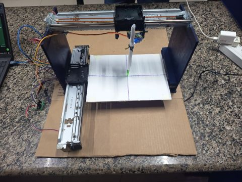

# Mini Plotter CNC 2D

Máquina de desenho automático construída com peças reaproveitadas de duas impressoras HP descartadas (eixos, guias lineares e correias). O usuário digita um texto ou escolhe uma forma no computador, uma aplicação em C# traduz isso em comandos e envia via Serial para um Arduino Uno, que aciona dois motores de passo 28BYJ-48 para mover a caneta nos eixos X e Y.

Projeto acadêmico desenvolvido por **Davi Nascimento Dias**, **Luanny Victória Araújo Saito** e **Maria Clara Fernandes Bartasson** — Uniube Uberlândia, curso de Sistemas de Informação, sob orientação da Profa. Kenia Arruda Martins da Costa. Apresentado na **5ª Mostratec Uniube Uberlândia** (17/06/2026).



## Status do projeto

Sendo direto sobre onde o projeto está hoje:

**Funciona:**
- Firmware do Arduino desenha formas geométricas de forma autônoma (quadrado, círculo, estrela de 5 pontas, cruz, espiral de Arquimedes), com controle de velocidade/aceleração via `AccelStepper` e posicionamento absoluto.
- Controle da caneta (eixo Z) via servo, subindo antes de deslocamentos "a vazio" e descendo antes de traçar.
- Modo de diagnóstico com cronômetro por movimento, que expõe objetivamente a perda de passos do motor.
- Modo de controle manual dos motores via teclado (Q/W/A/S/X), útil para jog manual e testes.

**Não funciona / incompleto:**
- A integração ponta a ponta (texto → app C# → JSON/G-code → Serial → desenho automático) existe em partes, mas ainda não roda de forma integrada. O que está neste repositório hoje é o firmware do Arduino; a aplicação desktop em C# ainda não está publicada aqui.
- Não há *home switch* — a origem `(0,0)` é sempre a posição física em que os motores estavam quando o Arduino foi ligado.
- Estrutura mecânica reaproveitada é instável (fixações improvisadas), o que introduz folga (*backlash*) na inversão de sentido dos eixos.

**Limitação de hardware conhecida (a mais relevante):** o motor de passo 28BYJ-48 opera em **malha aberta**, sem encoder e sem feedback de posição. O Arduino envia o pulso e assume que o motor obedeceu; se o motor perde passos por torque insuficiente, vibração ou folga mecânica, o firmware não tem como saber. Isso é visível em curvas contínuas (círculo, espiral), que saem levemente achatadas, e em polígonos, cujos vértices não fecham com exatidão. A velocidade/aceleração no firmware foi reduzida de 400 para 300 passos/segundo justamente para mitigar esse efeito.

> **Nota de consistência:** na fala de apresentação, o "segundo sketch" é descrito como uma ferramenta que combina movimento manual **e** cronômetro. No código-fonte enviado, isso está dividido em dois arquivos distintos: `diagnostico_cronometro` (sequência automática das mesmas formas, mas com cronômetro por movimento) e `controle_manual_teclado` (jog manual via teclado, sem cronômetro). Vale ajustar a fala ou unificar os dois comportamentos em um sketch antes da apresentação, para não gerar uma pergunta de banca sobre isso.

## Como funciona (fluxo pretendido)

1. Usuário digita, no computador, o texto ou a forma que deseja reproduzir no papel.
2. Aplicação em C# traduz a escolha do usuário em comandos customizados (coordenadas em formato G-code/JSON).
3. Os comandos são enviados via comunicação Serial (USB) para o Arduino Uno.
4. O Arduino aciona os motores de passo 28BYJ-48, movendo a caneta nos eixos X e Y e reproduzindo o desenho no papel.

Hoje, os passos 1–3 (aplicação C#) não estão neste repositório; o Arduino roda sequências de formas pré-programadas no firmware.

## Hardware

| Componente | Função no projeto |
|---|---|
| Arduino Uno | Controlador central do sistema |
| Motores de passo 28BYJ-48 (x2) | Movimentação dos eixos X e Y |
| Drivers ULN2003 (x2) | Acionamento dos motores de passo |
| Eixos X e Y reaproveitados (impressoras HP) | Estrutura mecânica: guias, eixos e correias |
| Servo motor | Levantar e abaixar a caneta (eixo Z) |
| Aplicação em C# (não incluída ainda) | Tradução da escolha do usuário em comandos customizados |
| Comunicação USB/Serial | Envio dos comandos do PC ao Arduino |

**Pinagem usada no firmware:**
- Motor 1 (eixo X): pinos 8, 10, 9, 11 (`AccelStepper::HALF4WIRE`)
- Motor 2 (eixo Y): pinos 4, 6, 5, 7 (`AccelStepper::HALF4WIRE`)
- Servo da caneta: pino 3 (posição levantada = 40°, abaixada = 80° — calibrar conforme montagem)

## Estrutura do repositório

```
mini-plotter-cnc-2d/
├── README.md
├── LICENSE
├── .gitignore
├── docs/
│   └── poster-mostratec.pdf        # Pôster oficial (90x120cm) apresentado na Mostratec
├── media/
│   ├── prototipo-bancada-01.png
│   ├── prototipo-detalhe-02.png
│   └── base-reaproveitada-03.png
└── firmware/
    ├── demo_automatico_v4.2/        # Desenha a sequência de formas automaticamente
    │   └── demo_automatico_v4.2.ino
    ├── diagnostico_cronometro/      # Mesma sequência, cronometrando cada movimento
    │   └── diagnostico_cronometro.ino
    └── controle_manual_teclado/     # Jog manual dos motores via teclado (Q/W/A/S/X)
        └── controle_manual_teclado.ino
```

## Como reproduzir

**Requisitos:**
- Arduino IDE (ou PlatformIO)
- Bibliotecas: [`AccelStepper`](https://www.arduinolibraries.info/libraries/accel-stepper) e `Servo` (instalar via Gerenciador de Bibliotecas do Arduino IDE)
- Arduino Uno + 2x driver ULN2003 + 2x motor 28BYJ-48 + 1x servo micro

**Passos:**
1. Abra a pasta do sketch desejado (`firmware/<nome-do-sketch>/`) na Arduino IDE — o nome do arquivo `.ino` precisa bater com o nome da pasta.
2. Confira a pinagem acima contra sua montagem física.
3. Faça o upload para o Arduino Uno.
4. Abra o Serial Monitor a 9600 baud.
5. No sketch de demonstração/diagnóstico: pressione Enter para liberar cada forma, ou digite um número + Enter para mudar o tamanho base. No sketch de controle manual: use Q/A (motor 1) e W/S (motor 2), X ou espaço para parar.

## Trabalhos futuros

- Substituir os motores 28BYJ-48 por motores de maior torque e precisão (ex.: NEMA 17 + driver A4988), eliminando a maior parte da perda de passos.
- Implementar um eixo Z motorizado para controle automático da caneta.
- Publicar e integrar a aplicação desktop em C# (texto → G-code → Serial), fechando o fluxo ponta a ponta.
- Adicionar *home switches* para zerar a origem de forma confiável a cada inicialização.
- Desenvolver uma interface gráfica para o usuário desenhar diretamente na tela do computador.

## Licença

Este projeto está licenciado sob a licença MIT — veja o arquivo [LICENSE](LICENSE) para detalhes. Ajuste conforme a política da instituição, se necessário.

## Créditos

Davi Nascimento Dias, Luanny Victória Araújo Saito, Maria Clara Fernandes Bartasson — Uniube Uberlândia, Sistemas de Informação. Orientação: Profa. Kenia Arruda Martins da Costa.
